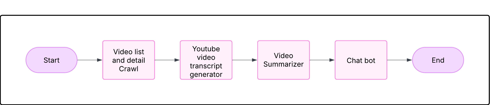

# YouTube Chatbot Project

A system to analyze YouTube channels and provide AI-powered Q&A with video context.

## Features
- YouTube channel video scraping
- Transcript processing and summarization
- Vector embeddings storage
- Context-aware chatbot answers with timestamped references

## Setup
1. Install requirements: `pip install -r requirements.txt`
2. Create `.env` file with API keys
3. Run `python main.py`

Required API keys:
- YouTube Data API v3 [[How to get?](https://developers.google.com/youtube/v3/getting-started)]
- OpenAI API [[How to get?](https://help.openai.com/en/articles/4936850-where-do-i-find-my-openai-api-key)]

How to Use:
- Option `1`: Process Youtube Video By Video Id
- Option `2`: Ask Bot Question with Pre Loaded YouTube Vide Information
- Option `3`: Process complete Youtube Channel by Channel Id
- Option `4`: See Table information
- Option `5`: See Chroma DB information[Vector Information]
- Option `6`: Add to .env
- Option `7`: Print .env

# Example

## Step 1: Process Video Id 
1. Run the program, use option `1`
2. Put Video_Id=`ZBDv4tDfzW4` 
    - find the Video [here](https://www.youtube.com/watch?v=ZBDv4tDfzW4)
- **Outcome**: Step 1, app will process the video and store in vector chunk

## Step 2: Run Bot and ask Question on the video processed
1. Run the program, use option `2`
2. Ask following Question:
```
     You: `what is structured vs unstructured data?`
     Bot:
================================== Ai Message ==================================

    - Structured data is data that is organized in a tabular format with rows and columns, making it easy to search, sort, and analyze.
    - Unstructured data, on the other hand, includes data like documents in PDF or Word format, chat transcripts, and more, which do not have a predefined data model and are harder to analyze.

    References:
    - codeLive: Simplify RAG for Agents with Einstein Data Library (https://youtu.be/ZBDv4tDfzW4?t=316) [316.039-321.24s]
    - codeLive: Simplify RAG for Agents with Einstein Data Library (https://youtu.be/ZBDv4tDfzW4?t=285) [285.479-288.87899999999996s]
    - codeLive: Simplify RAG for Agents with Einstein Data Library (https://youtu.be/ZBDv4tDfzW4?t=630) [630.56-634.7209999999999s]
```

# Here are different components of my project

- **Video list and detail Crawl:** This module help me get videos in provided channel/video id and finds additional details of video such as video url, title, description, length etc.
- **You-tube video transcript generator:** This is responsible for getting complete video transcript using python library called youtube_transcript_api
- **Video Summarizer:** As main objective of this POC is to help leaner find exact place where topic related to his query discussed in the video, we do following for finding out video summary
  - Split the full video transcript into smaller chunks preserving the start and end time of the chunk
  - Using open-ai gpt-3.5-turbo, summaries the chunk
  - Create embedding of summary using OpenAI embeddings model
  - Store the video detail with summary and embeddings in vector database [we used chroma]
- **Chat-bot:**
  - Create chatbot that seek a question from user
  - To generate the answer, it does below
    - Generate embedding of question
      - Use vector similarity search to retrieve relevant video stored in chromed
      - Provide this result to LLM [model = open-ai gpt-3.5-turbo] and a prompt to generate answer
      - As a result, user get answer to the questions with video snippet link where the topic was discussed
